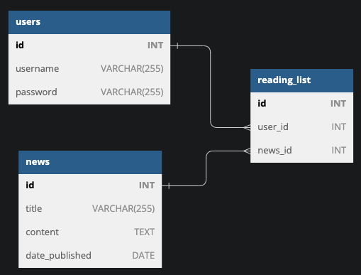

# Gin-news-api

## How to run

```golang
$ git clone https://github.com/lin121291/Gin-api.git
$ cd Gin-api

// install required go package
$ go mod tidy

//run docker postgresql container
make postgres

//use makefile
$ make server

```

## Database migration

```golang
$ make migrateup

$ make migratedown
```

## Database scheme


